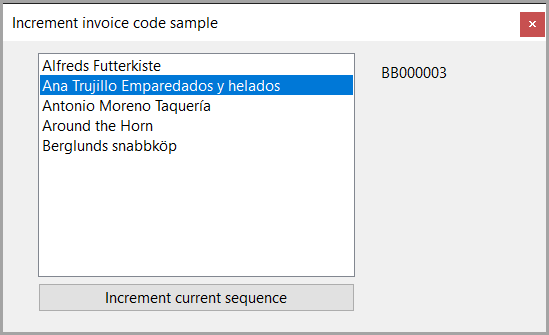

# About

This is a Dapper version of next value. As with the other samples there is no handling concurrency conflicts for the same reason as the other code samples which is, one customer per person handling a customer, similar to a waitress handling one table at a restaurant.

For the purist reading this, you know how to do this so handle it and for those who have no idea see [Concurrency problems – theory and experimentation in SQL Server](https://www.sqlshack.com/concurrency-problems-theory-and-experimentation-in-sql-server/) which is lower level that Dapper but can be applied to code presented here or check out [the following](https://learn.microsoft.com/en-us/archive/technet-wiki/51497.net-defensive-data-programming-part-2#incorrectly-handling-constraint-violations-with-update).

## Why Windows Forms?

Simple because its easier to standup than other project types.

## Base code/Requires

In SequenceLibrary class project using NET6 is suitable for any .NET Core from 6 onwards.

Note this project is NET8

## Before running

1. Create the database NextValueDatabase under (localdb)\MSSQLLocalDB or change the server in appsettings.json
1. Populate tables with scripts\populate.sql

## Next

**Considerations**

- Add a year column to the mix so that invoices can be filtered by year
- Write code or instructions to reset if a max value is hit or a reset for each year back to XX00000. Also note here 00000 is used, that is only for the demo, use as many zeros that suit your requiements.
