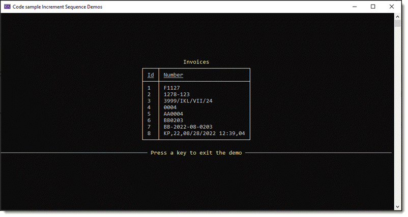

# Auto-Incrementing Sequences

In this article, learn how to deal with orders and invoices there, needs to be a method to track them, which may be an alphanumeric value.

I originally used the [following](https://github.com/karenpayneoregon/Increment-AlphaNumeric-Value/blob/master/UtilityLibrary/StringHelpers.cs#L12:L58) which would be overkill for most simple projects yet is viable for larger solutions.

Real life examples, taking an order at a restaurant where the order number consist of the waiter’s identifier, transaction date/time, a transaction number and an incrementing value.

Perhaps the model might be

```csharp
public class Transaction
{
    public string UserIdentifier { get; set; }
    public DateTime DateTime { get; set; }
    public int Id { get; set; }
    public int RegisterNumber { get; set; }

    public override string ToString() => $"{UserIdentifier},{RegisterNumber},{Id}";
}
```

By having unique segments like waiter’s identifier there is no chance of issues in the backend database.

The same would be true for other examples like a person calls in an order to a store, the person taking the order has a unique identifier.

# EF Core

In this example the following tables are used

| Table        |   Description    |   Note |
|:------------- |:-------------|:-------------|
| Customers | Has customer details |  |
| CustomerSequence | Has one record per customer to store thier sequence and a prefix to compose the final sequence | AA1 first sequence for first customer  |
| :small_blue_diamond: | | I kept the prefix short but can be whatever you want|
| Ordrers | Customer orders |  |


```csharp
public static bool EntityFrameworkExample2(int customerId)
{
    using var context = new Context();
    // Get customer to add a new order
    var customer = context.CustomerSequence.FirstOrDefault(x => x.CustomerIdentifier == customerId);
    if (customer is not null)
    {
        var prefix = customer.SequencePreFix;
        var sequenceValue = customer.CurrentSequenceValue;

        /*
            * If this is the first order for a customer start the sequence, otherwise increment
            * the sequence
            */
        sequenceValue = string.IsNullOrWhiteSpace(sequenceValue) ? 
            $"{prefix}{Helpers.NextValue("0")}" : 
            Helpers.NextValue(sequenceValue);

        // update the sequence
        customer.CurrentSequenceValue = sequenceValue;

        // add a new order
        Orders order = new() { CustomerIdentifier = customer.Id, InvoiceNumber = sequenceValue, OrderDate = DateTime.Now };

        context.Orders.Add(order);
        return context.SaveChanges() == 2;


    }
    else
    {
        return false;
    }
}
```

# Method for incrementing

```csharp
public class Helpers
{
    /// <summary>
    /// Given a string which ends with a number, increment the number by 1
    /// </summary>
    /// <param name="sender">string ending with a number</param>
    /// <returns>string with ending number incremented by 1</returns>
    public static string NextValue(string sender)
    {
        string value = Regex.Match(sender, "[0-9]+$").Value;
        return sender[..^value.Length] + (long.Parse(value) + 1)
            .ToString().PadLeft(value.Length, '0');
    }
}
```

</br>

If the code may be used in multiple applications that need distinctful names we can write a wrapper on the method above thus in turn could reside in a team library.


```csharp
public static string NextInvoiceNumber(string sender, int incrementBy) => NextValue(sender, incrementBy);
```

# Example code



The model used, a simple invoice which uses [protobuf-net](https://www.nuget.org/packages/protobuf-net/) [^1] NuGet package to store information in a binary file.

```csharp
[ProtoContract]
public class Invoice
{
    [ProtoMember(1)]
    public int Id { get; set; }
    [ProtoMember(2)]
    public string Number { get; set; }
}
```

</br>

In the `Operation.cs` class for the first use we mock-up data with various formats to show the `NextValue` method works on different formats.

```csharp
public static List<Invoice> Invoices => new()
{
    new() { Id = 1, Number = "F1124" },
    new() { Id = 2, Number = "1278-120"},
    new() { Id = 3, Number = "3999/IKL/VII/21"},
    new() { Id = 4, Number = "0001"},
    new() { Id = 5, Number = "AA0001"},
    new() { Id = 6, Number = "BB0200"},
    new() { Id = 7, Number = $"BB-{Now.Year}-{Now.Month:D2}-0200"},
    // id, register number, transaction date/time, transaction number
    new() { Id = 8, Number = $"KP,22,{Now:MM/dd/yyyy hh:mm},01"},
};
```

Then to increment the value this is done in `DataOperations.Save()` method.

```csharp
public static void Save(List<Invoice> list)
{
    for (int index = 0; index < list.Count; index++)
    {
        var newValue = Helpers.NextValue(list[index].Number);
        list[index].Number = newValue;
    }

    SerializeInvoices(list);
}
```

In Program class (under the Classes folder), if the binary file does not create then create the file with data from above.

:point_right:uncomment `Operations.Reset()` to delete the binary file to start over (or simply delete the file in Explorer)


```csharp
[ModuleInitializer]
public static void Init()
{
    // use to reset invoices back to original state
    //Operations.Reset();

    if (!File.Exists(Operations.FileName))
    {
        Operations.CreateReadInvoice();
    }

}
```

# Summary

Using `NextValue` method with a properly thought out schema for data storage provide you with auto-incrementing alpha numeric values.

If there is a need for performing this with more assertions check out my Microsoft TechNet article [Auto-incrementing alphanumeric invoice number](https://social.technet.microsoft.com/wiki/contents/articles/53956.c-auto-incrementing-alphanumeric-invoice-number.aspx) with source code working with Entity Framework Core,


[^1]: protobuf-net is a contract based serializer for .NET code, that happens to write data in the "protocol buffers" serialization format engineered by Google. The API, however, is very different to Google's, and follows typical .NET patterns (it is broadly comparable, in usage, to XmlSerializer, DataContractSerializer, etc). It should work for most .NET languages that write standard types and can use attributes.